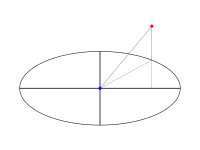

# Camera

The Camera Component allows the user to see.

## Moving The Camera By Input
There are multiple functions that use the value from EButtonInput or EAnalogInput to change a different velocity property.
The value of the event will affect how fast the camera will be moving.

## Throttle
Throttle variables scale the input data to set the velocity in provided input event functions.

Example:

forward_throttle = 2.0f

MoveDirectly Is Executed: e->value = 1.0f

Total Forward Velocity = 2 x 1 = 2 u/f

## Free Cam
When free_cam is set to true, the camera can move and rotate freely around the level it's attached to.

AttachRod() will disable free_cam.

## Rod
By using AttachRod(), the camera will lock itself a set distance from an Actor.

Picture an imaginary rod connecting the Camera to the Actor.

Use rod_lock to force the camera to always look at the Actor. Rotation and Rotation Velocity are updated accordingly.

## Tick
The velocities are multiplied by Delay() to adjust for frame rate.

